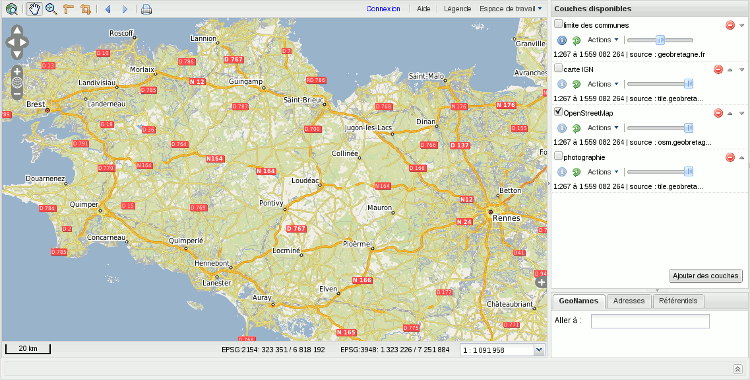
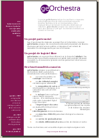

.. geOrchestra website master file, created by
   sphinx-quickstart on Mon Sep 21 16:47:05 2009.
   You can adapt this file completely to your liking, but it should at least
   contain the root `toctree` directive.
.. http://www.source-gratuit.com/349-telecharger-template-gratuit-Delivering.html
.. http://www.source-gratuit.com/479-telecharger-template-gratuit-Corporate-Ltd.html
        
.. _`georchestra.index`:

.. raw:: html
  :file: slides.html

GeOrchestra project aims to develop a Spatial Data Infrastructure
**customizable**, **interoperable** and **free**, based on
the best map components available.

Referenced by the Adullact_ portal, geOrchestra offers a solution
to publish and share spatial data on intranet and internet.

For a quick presentation of geOrchestra and its components, you can read
:ref:`georchestra.documentation.overview`. You can have a look to
:ref:`georchestra.documentation.fiche_identite` in order to have a better 
knowledge of features offered by geOrchestra.

You can find some help with the community mailing list: see Community Page.

Finally kiep in touch with geOrchestra development with the 
`blog <http://blog.georchestra.org>`_ and `Twitter <https://twitter.com/#!/georchestra>`_.

Main Features
==============

geOrchestra project is built around several independent and interoperable applications:

* a catalog, with a featuer to publish geodata
* a viewer and an editor,
* a data extractor,
* a map server,
* a content page system.

These various modules are loosely coupled, meaning that the
operation of each module does not affect the other. Communication
between modules uses OGC standards.

An answer to the INSPIRE directive
===========================================

   
geOrchestra was designed to meet the requirements of the `INSPIRE Directive <http://inspire.jrc.ec.europa.eu/>`_,
which aims to establish a spatial data infrastructure on a European scale, with the aim to meet
the challenges of sustainable development:

* discovery, view and download spatial data services,
* permanent link between the geographic data and its metadata,
* standards promoted by INSPIRE (see below),
* administration tools to facilitate the management of INSPIRE (INSPIRE themes, thesaurus GEMET, INSPIRE conformity assessment, etc.),
* facilitating data usage through web services.

Standards Implementation
==========================

geOrchestra is based on OGC standards, including:

* `WMS <http://www.opengeospatial.org/standards/wms>`_ : Web Map Service
* `WMTS <http://www.opengeospatial.org/standards/wmts>`_ : Web Map Tile Service
* `WFS <http://www.opengeospatial.org/standards/wfs>`_ : Web Feature Service (with transactional feature)
* `WCS <http://www.opengeospatial.org/standards/wcs>`_ : Web Coverage Service
* `WMC <http://www.opengeospatial.org/standards/wmc>`_ : Web Map Context
* `SLD <http://www.opengeospatial.org/standards/sld>`_ : Styled Layer Descriptor
* `FE <http://www.opengeospatial.org/standards/filter>`_ : Filter Encoding
* `CSW <http://www.opengeospatial.org/standards/cat>`_ : Catalog Service

User and Developer Communities
================================

The project is supported by a growing community of developers and enthusiastic users.

Several companies offer commercial support:

* `Camptocamp <http://camptocamp.com>`_ : offers support on free and open souce software, from Chambéry (France) and Lausanne (Swisstzerland), is the designer of the solution from `GeoBretagne project <http://geobretagne.fr>`_. Camptocamp offers integration services of geOrchestra, support, custom developement and training (users, system administrator et data administrator).
* `DotGee <http://www.dotgee.fr/#>`_ : company located at Rennes, offers some custom developement support around this SDI.

.. toctree::
   :maxdepth: 2
   :hidden:
   
   documentation/index
   community
   download
   about

.. _Adullact: https://adullact.net/projects/georchestra/

