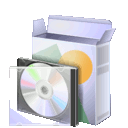

.. _`georchestra.es.documentation.index`:

===============
Documentación
===============

Esta sección contiene la documentación sobre el proyecto geOrchestra. Usted 
puede descargar la documentación en formato PDF: 
`georchestra.pdf <http://svn.georchestra.org/georchestra/trunk/website/documentation/_static/georchestra_26042012.pdf>`_

Gobierno
==============

.. toctree::
   :maxdepth: 1
   
   psc
   rfc

Les RFC proposées, discutées et votées sont disponibles dans la section `RFC dans
le wiki <http://applis-bretagne.fr/redmine/projects/georchestra/wiki/RFC>`_ de la 
forge.

Presentación
=============

.. toctree::
   :maxdepth: 1
   
   overview
   fiche_identite
   feature

Instalación
=============

.. toctree::
   :maxdepth: 1
   
   installation
   postinstall
   search_address
   security

Una `versión en español <../../sp/documentation/installation.html>`_ se encuentra disponible.

Utilización
============

Una documentación esta en curso de incorporar en el sitio, pongase en contacto con nosotros
si desea contribuir!

Administrador
---------------

.. toctree::
   :maxdepth: 2

   administrateur/index

Usuario
------------

.. toctree::
   :maxdepth: 2
   
   utilisateur/index
   
Desarrollador
------------

.. toctree::
   :maxdepth: 2

   developer/index

F.A.Q.
========

.. toctree::
   :maxdepth: 3
   
   faq

