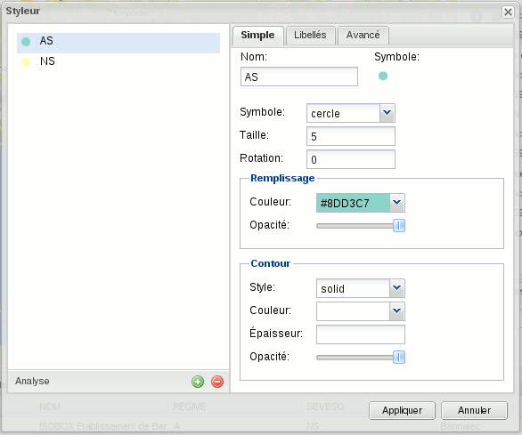
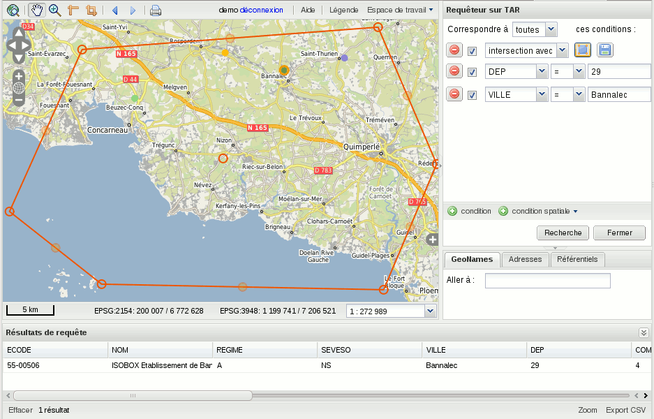
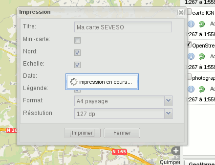
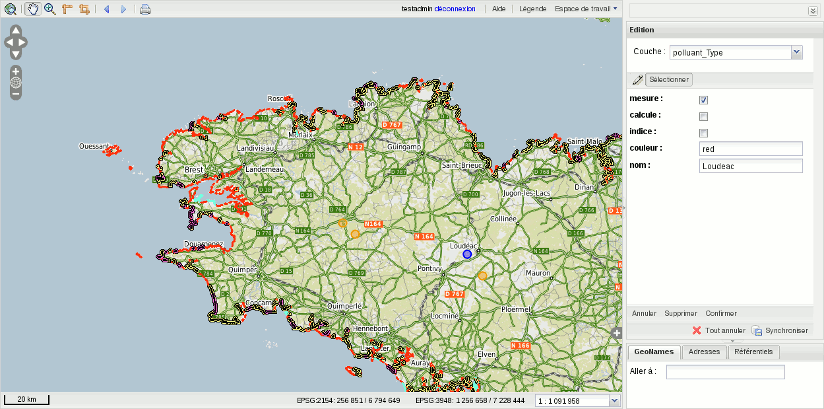
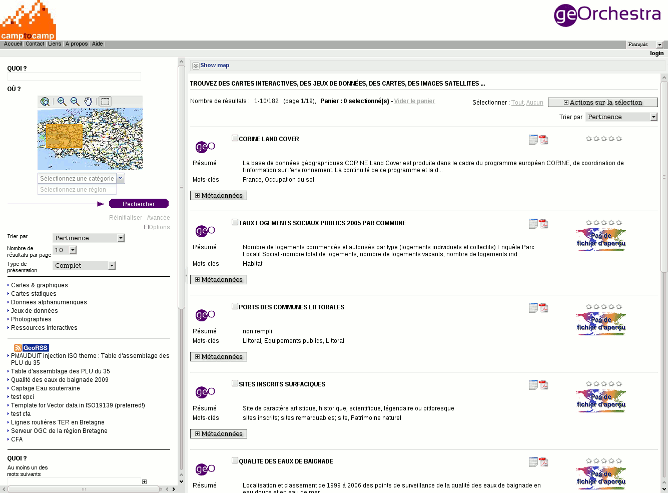
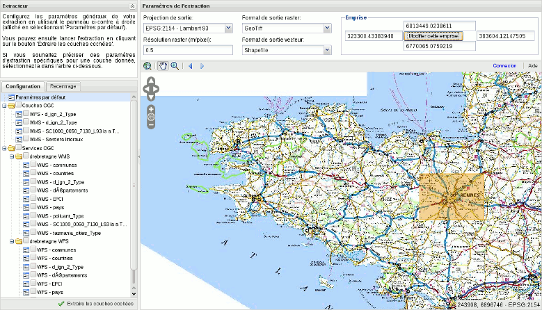

.. _`georchestra.es.documentation.overview`:

============================
Introducción a las características
============================

Para una lista completa de las características, visite la página 
:ref:`georchestra.es.documentation.feature`.

Arquitectura
============

Enfoque modular
-----------------------

La arquitectura de geOrchestra se compone de varios módulos independientes.
Una implementación de geOrchestra puede evolucionar sin problemas: partiendo de un
servidor de mapas, a continuación uno o más visualizadores... hasta formar 
un conjunto completo.

Estándares
---------------------

Los módulos cumplen con los estándares OGC recomendados por INSPIRE. Toda la 
interacción entre los módulos utilizan dichas normas: el sistema es interoperable 
con otros sistemas que cumplan con los mismos estándares, también es interoperable
internamente, y se puede adicionar de manera muy fácil funcionalidades de un componente
externo.
Por ejemplo puede utilizar QGIS o ArcGIS para construir una capa de símbolos, 
a continuación puede exportar este trabajo a geOrchestra.

Le suivi de la charge
---------------------

Geoserver est utilisé dans des installations subissant de très fortes charges. 
Son intégration native du tuilage lui permet de répondre aux fortes sollicitations
ou peut servir des couches très volumineuses.

Visualizador
===========

El visualizador de geOrchestra es un modulo independiente de consultas a los mapas.
Desde un navegador web, el usuario puede buscar, cargar, y consultar los mapas. 
El visualizador funciona en las versiones recientes de Firefox, Internet Explorer, 
Opera, Chrome, Safari.

.. image:: _static/georchestra_viewer.png

Desde la interfaz del visualizador, el usuario puede consultar los catálogos 
que siguen los estandares de INSPIRE, puede leer el contenido de los datos
(fuente, validez, derechos...) y consultar los ficheros asociados antes de cargar el mapa.

Tambien puede examinar los servicios "WMS" si conoce la dirección completa, 
y finalmente, utilizar los servicios ya referenciados. 

La interfaz está diseñada para adecuarse a todos los tamaños de pantalla, paneles 
laterales desplegables ofreciendo un área mayor de visualización en pantallas 
pequeñas, alors que le chargement par tuiles optimise l'affichage sur de grands 
écrans.

.. nota::
    Las configuraciones de las capas se almacenan en documentos ligeros 
    llamados "contextos" que pueden ser recargados, modificados, y pueden compartirlo con terceros.

    El visualizador puede ser insertado en un sitio web existente. La configuración es 
    personalizado por el administrador del sitio:
    datos cargados de forma predeterminada, proyección, control, catálogo y servicios web, 
    rendimiento de los navegadores...

Estilo
---------

El estilo es una funcionalidad avanzada del visualizador, para personalizar las capas 
de acuerdo a las necesidades del usuario.
Esto permite establecer reglas de presentación (forma, color, 
transparencia, police) en función a los datos: por ejemplo,
representar los elementos de tipo "forestal" de color verde y no mostrar el tipo 
"urbanizada", o resaltar las "parcelas de menos de 500m2".
El estilo no descarga los datos: los servidores realizan su trabajo. Se puede 
trabajar con grandes volúmenes de información como el catastro, con
el mismo nivel de rendimiento.

.. nota::
    Los estilos generados se pueden almacenar o intercambiar con terceros. 
    El usuario puede crear su propia biblioteca de capas correspondiente a
    sus necesidades.

Consultas
----------

A diferencia del estilo, las consultas realiza la descarga de los datos para 
representar en el navegador, ver todos los atributos en una tabla, 
y si se desea exportar los datos a una hoja de cálculo. 
Las consultas pueden ser filtros espaciales (por ejemplo : puntos de intersección, 
lineas, polígonos dibujados por el usuario) y filtro por atributos
(por ejemplo: un valor comprendido entre dos números) que se modifica
para lograr el resultado deseado.

Imprimir
-----------

La función para imprimir inserta las capas en un documento PDF con
plantillas prefabricadas.

Editor
---------

El editor utiliza el estándar WFS-T (Transaccional) para permitir 
al usuario cambiar los objetos que componen el mapa. Se puede 
adicionar y/o editar la información en linea: un perímetro 
a estudiar con la descripción, localizar un documento existente, 
una vía existente,... La función de edición esta basado en la construcción 
de capas colaborativas.

Catálogo
==========

El catálogo hace referencia a los metadatos. Cumpliendo con las normas INSPIRE, el 
catálogo es un punto muy importante para el usuario mediante el cual 
reconoce los datos del propietario, búsqueda por temas o palabras clave disponibles, 
y permite la comunicación con otros módulos visualizador o extraer. 
El catálogo está basado en GeoNetwork, herramienta para hacer referencia a los
estándares CSW. 

Extractor
===========

El extractor es un módulo independiente para la descarga de los datos, y su posterior 
uso por software de terceros. Delimita un área geográfica,
seleccionar una sección de datos, el formato de proyección, obtener 
una conjunto de datos personalizados. Esta operación es a menudo largo,
el extractor muestra un mensaje al finalizar la operación para informar
que la descarga esta disponible.

Servidor de mapas
=======================

El servidor de mapas de geOrchestra es Geoserver, una herramienta poderosa 
para publicar los mapas mediante los estándares INSPIRE. Equipado con una interfaz de usuario afrancesado,
Geoserver proporciona al administrador un control de los datos sobre los 
aspectos de la publicación: descripción de las capas, formatos de salida, derechos de acceso, 
estilos... El formato de elección para los datos es el SHAPEFILE, Geoserver trabaja 
con otro tipo de fuentes de datos y por lo tanto se puede integrar con los sistemas de información  
ya existentes. 

Geoserver proporciona el Web Processing Service WPS, un servicio de procesamiento de datos potente, comparado con
los Sistema de Información Geográfica. 

Geopublisher
=============

El geopublisher es una herramienta de productividad para el administrador de los datos: 
coordina la descripción de los datos en el catálogo con la publicación de los servicios. 
El geopublisher permite una publicación rápida de un gran conjunto de datos simples.

