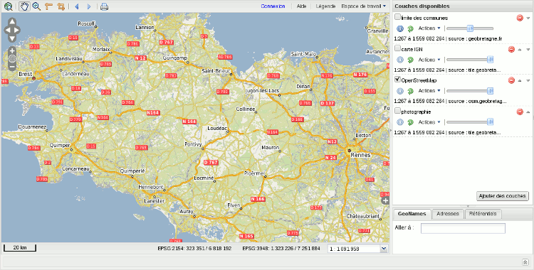

.. geOrchestra website master file, created by
   sphinx-quickstart on Mon Sep 21 16:47:05 2009.
   You can adapt this file completely to your liking, but it should at least
   contain the root `toctree` directive.
.. http://www.source-gratuit.com/349-telecharger-template-gratuit-Delivering.html
.. http://www.source-gratuit.com/479-telecharger-template-gratuit-Corporate-Ltd.html
        
.. _`georchestra.es.index`:

.. raw:: html
  :file: slides.html

El proyecto geOrchestra tiene como objetivo desarrollar una Infraestructura de 
Datos Espaciales **modular**, **interoperable** y **libre**, esta basado  
en los mejores componentes de mapeo disponible.

Referencia para el Adullact_, geOrchestra ofrece una solución llave en mano
para publicar y compartir sus datos localizados mediante Intranet e Internet.

.. image:: _static/flyer_small.png
   :class: around-left
   :target: _static/flyer_georchestra.pdf

Para una presentación visual de la solución geOrchestra y sus componentes, 
le invitamos a consultar :ref:`georchestra.es.documentation.overview`. También puede ver 
:ref:`georchestra.es.documentation.fiche_identite` para tener un conocimiento de las características 
que ofrece geOrchestra.

Usted puede encontrar ayuda a través de la lista: vea la sección comunidad.

Finalmente mantenerle informado de los avances del proyecto a través del
`blog <http://blog.georchestra.org>`_ y la cuenta `Twitter <https://twitter.com/#!/georchestra>`_ dedicado.

Características principales
===========================

El proyecto geOrchestra se basa en una serie de módulos completamente independientes e interoperables:

* Un catálogo, con una función para publicar información geográfica,
* Un visualizador y editor,
* Un Extractor,
* Un servidor de mapas,
* Una página editorial.

Estos módulos están débilmente acoplados, lo que significa que el funcionamiento 
de cada módulo no afecta a los otros. La comunicación 
entre los módulos utiliza los estándares de la OGC.

Una respuesta eficaz a la Directiva INSPIRE
===========================================

.. image:: _static/logo_inspire.png
   :width: 150px
   :class: around-right
   :alt: INSPIRE
   
geOrchestra fue diseñado para cumplir con los requerimientos de la `directiva de INSPIRE <http://inspire.jrc.ec.europa.eu/>`_, 
que tiene como objetivo establecer una Infraestructura de Datos Espaciales a nivel Europeo, con el objetivo
de satisfacer los retos del desarrollo sostenible:

* descubrir, visualizar y descargar los servicios de datos espaciales,
* vínculo permanente entre los datos geográficos y sus metadatos,
* estándares promovidas por INSPIRE (véase más adelante),
* herramientas de administración para facilitar la gestión de INSPIRE (temas INSPIRE, tesauro gemet, evaluación de la conformidad INSPIRE, etc),
* facilitar la utilización de los datos a través de servicios web.

Implementación de los estándares
=============================

geOrchestra basado en los estándares de la OGC, incluyendo:

* `WMS <http://www.opengeospatial.org/standards/wms>`_ : Web Map Service
* `WMTS <http://www.opengeospatial.org/standards/wmts>`_ : Web Map Tile Service
* `WFS <http://www.opengeospatial.org/standards/wfs>`_ : Web Feature Service (dont transactionnel)
* `WCS <http://www.opengeospatial.org/standards/wcs>`_ : Web Coverage Service
* `WMC <http://www.opengeospatial.org/standards/wmc>`_ : Web Map Context
* `SLD <http://www.opengeospatial.org/standards/sld>`_ : Styled Layer Descriptor
* `FE <http://www.opengeospatial.org/standards/filter>`_ : Filter Encoding
* `CSW <http://www.opengeospatial.org/standards/cat>`_ : Catalog Service
* `WPS <http://www.opengeospatial.org/standards/wps>`_ : Web Processing Service

Una comunidad de usuarios y desarrolladores
================================================

El proyecto es apoyado por una creciente comunidad de desarrolladores y usuarios entusiastas.

Muchas compañías ofrecen soporte comercial:

* `Camptocamp <http://camptocamp.com>`_ : empresa de servicios de software libre, con sede en Chambéry, es el diseñador de la solución del proyecto `GeoBretagne <http://geobretagne.fr>`_. Camptocamp ofrece servicios de integración con la infraestructura geOrchestra, da soporte en desarrollos
 personalizados y formación (usuarios, administradores de sistemas y administradores de datos).
* `DotGee <http://www.dotgee.fr/#>`_ : empresa ubicada Rennes, ofrece una apoyo personalizado y desarrollo a medida alrededor de la plataforma geOrchestra.

.. toctree::
   :maxdepth: 2
   :hidden:
   
   documentation/index
   community
   download
   about

.. _Adullact: https://adullact.net/projects/georchestra/

